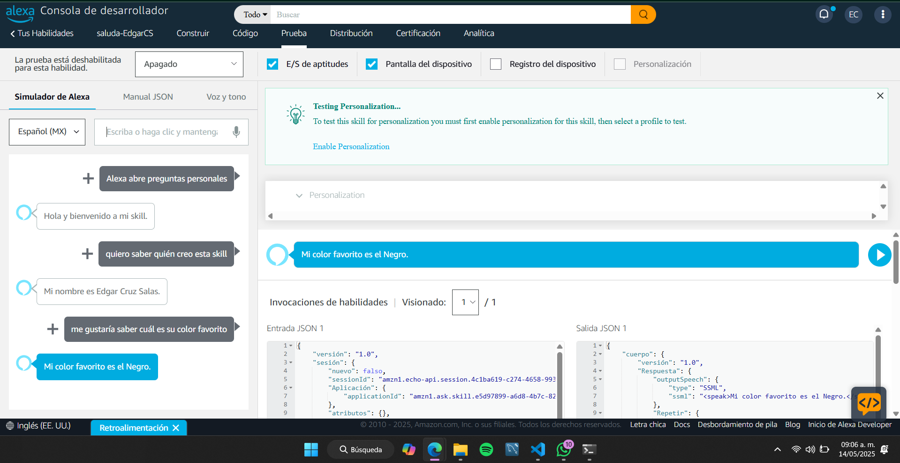
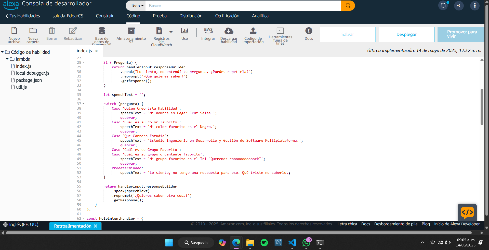

## Logos de la Universidad

  
  

 
# Práctica: Desarrollo de Skills para Alexa

## Materia
Extracción de conocimientos de Bases de Datos

## Alumno
**Nombre:** Edgar Cruz Salas  
**Matrícula:** 220219

## Descripción de la Práctica
#Paráctica 03
En esta práctica desarrollamos una skill personalizada para Alexa, utilizando el entorno de desarrollo de Amazon Developer Console junto con AWS Lambda.

El objetivo principal fue comprender el flujo de interacción entre el usuario y Alexa mediante intents, slots y respuestas personalizadas. Durante el desarrollo:

- Se diseñó una skill básica con interacción por voz.
- Se configuraron intents y utterances.
- Se integró con una función Lambda para el procesamiento.
- Se probó y depuró la skill usando el simulador de Alexa.

## Captura de pantalla de la Skill

  
  

